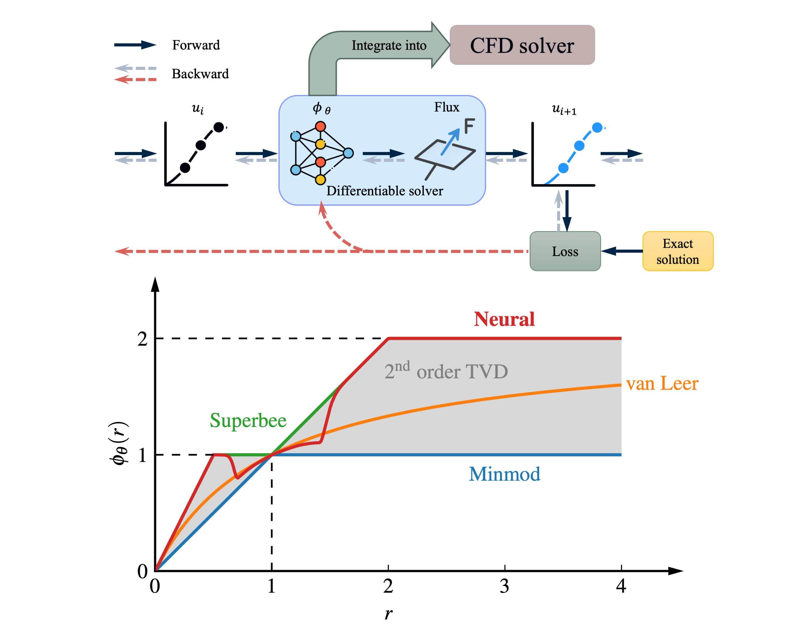
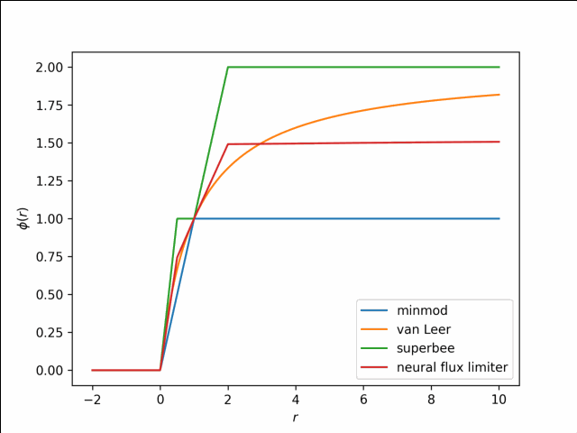

# Learning second-order TVD flux limiters using differentiable solvers
## Overview

This repository implements a **differentiable physics framework for learning second-order TVD flux limiters** for finite-volume methods. Classical flux limiters are replaced by neural networks embedded directly inside fully differentiable solvers, enabling end-to-end gradient-based optimization while **guaranteeing TVD stability and second-order accuracy by construction**.

The differentiable physics flux limiter (DPFL) is parameterized as a convex combination of Minmod and Superbee, ensuring it always remains inside the Sweby second-order TVD region. Remarkably, a limiter trained only on **1D linear advection** generalizes effectively to **Burgers’ equation, the Euler equations, and multi-dimensional flows**, and can be integrated into **OpenFOAM** without modifying the solver core.

This repo contains training and testing scripts, data, demos, plotting utilities, and OpenFOAM integration code used in the accompanying paper:
*Learning second-order total variation diminishing flux limiters using differentiable solvers*.

## Repository layout:
- `configs/` – experiment configuration files (training, data, model, optimizer, etc.)
- `data/` – datasets / generated training data
- `demo/` – A Jupyter notebook in Google Colab for training a flux limiter on linear advection written in JAX
- `openfoam/` – OpenFOAM cases and implementation for flux limiter integration
- `plots/` – plotting scripts (e.g., limiter curves, contours, error tables)
- `src/` – main Python source code (models, solvers, training loops, utilities)
- `tests/` – multiple test cases
- `model_linear_relu.pt` – the final learned flux limiter model from the paper
- `fl_linear_adv_relu.gif` – Evolution of the learned flux limiter with training epoch

