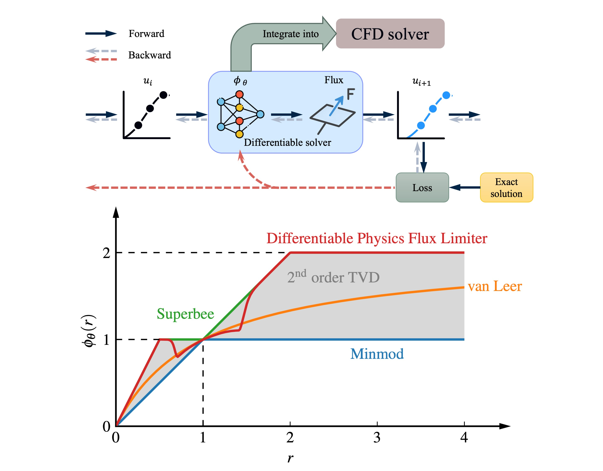

# Learning second-order TVD flux limiters using differentiable solvers 

[**arXiv preprint**](https://doi.org/10.48550/arXiv.2503.09625)

**Chenyang Huang**, **Amal S. Sebastian**, **Venkatasubramanian Viswanathan**

 


---

## Overview



This repository implements a **differentiable physics framework for learning second-order TVD flux limiters** for finite-volume methods. Classical flux limiters are replaced by neural networks embedded directly inside fully differentiable solvers, enabling end-to-end gradient-based optimization while **guaranteeing TVD stability and second-order accuracy by construction**.


The differentiable physics flux limiter (DPFL) is parameterized as a convex combination of Minmod and Superbee, ensuring it always remains inside the Sweby second-order TVD region. Remarkably, a limiter trained only on **1D linear advection** generalizes effectively to **Burgers’ equation, the Euler equations, and multi-dimensional flows**, and can be integrated into **OpenFOAM** without modifying the solver core.

This repo contains training and testing scripts, data, demos, plotting utilities, and OpenFOAM integration code used in the accompanying paper:
*Learning second-order total variation diminishing flux limiters using differentiable solvers*.

## Repository layout:
- `configs/` – experiment configuration files (training, data, model, optimizer, etc.)
- `data/` – datasets / generated training data
- `demo/` – A Jupyter notebook in Google Colab for training a flux limiter on linear advection written in JAX
- `openfoam/` – OpenFOAM cases and implementation for flux limiter integration
- `plots/` – plotting scripts (e.g., limiter curves, contours, error tables)
- `src/` – main Python source code (models, solvers, training loops, utilities)
- `tests/` – multiple test cases
- `model_linear_relu.pt` – the final learned flux limiter model from the paper
- `model_linear_relu_weights.txt` – weights of the learned flux limiter model
- `dpfl_linear_adv_relu.gif` – Evolution of the learned flux limiter with training epoch
- `requirements.txt` – Python dependencies

## Installation
1. Clone the repository:
```bash
git clone https://github.com/BattModels/diff-phys-flux-limiter.git
```

2. Create and activate a virtual environment, then install dependencies:
```bash
python -m venv .venv
source .venv/bin/activate
pip install -r requirements.txt
```
3. (Optional) Install OpenFOAM and set up the environment for OpenFOAM integration.
The implementation has been tested with OpenFOAM-12 and OpenFOAM-v2012.

## Train a flux limiter
Take 1D linear advection as an example, run the following command:
```bash
python src/train_fl_linear_adv.py
```
or you want to use a specific configuration file:
```bash
python src/train_fl_linear_adv.py --config-path configs/ --config-name config.yaml
```
This will save the trained model and upload the training logs to wandb.

## Use DPFL in OpenFOAM
Take OpenFOAM-12 as an example, follow the steps below to compile and use the learned flux limiter in OpenFOAM simulations.
### 1. Activate your OpenFOAM environment
```
# Example (adjust to your installation)
source /opt/openfoam/OpenFOAM-12/etc/bashrc
```
### 2. Compile the limiter
Navigate to the `openfoam/Neural` directory and compile the limiter:
```bash
cd openfoam/Neural
wmake
```
This will produce a shared library named something like: `libNeural.so` in path prescribed in `openfoam/Neural/Make/files`. One can set the path to the user lib path `$FOAM_USER_LIBBIN` or put the compiled library anywhere, just include the path in `controlDict` for your own case.

### 3. Choose Neural or NeuralV limiter in OpenFOAM case
In your OpenFOAM case, edit the `system/fvSchemes` file to use the limiter. For example, to use the `Neural` limiter for velocity field:
```
divSchemes
{
    default         Gauss linear;
    div(phi,U)      Gauss NeuralV; // for velocity field
}
```
‘V’-schemes are specialised versions of schemes designed for vector fields. They differ from conventional schemes by calculating a single limiter which is applied to all components of the vectors, rather than calculating separate limiters for each component of the vector. If you want to use the component-wise limiter, just change `NeuralV` to `Neural`.


## Citation

If you use this code in your research, please cite:

```bibtex
@article{huang2025learning,
  title={Learning second-order TVD flux limiters using differentiable solvers},
  author={Huang, Chenyang and Sebastian, Amal S and Viswanathan, Venkatasubramanian},
  journal={arXiv preprint arXiv:2503.09625},
  year={2025}
}
```